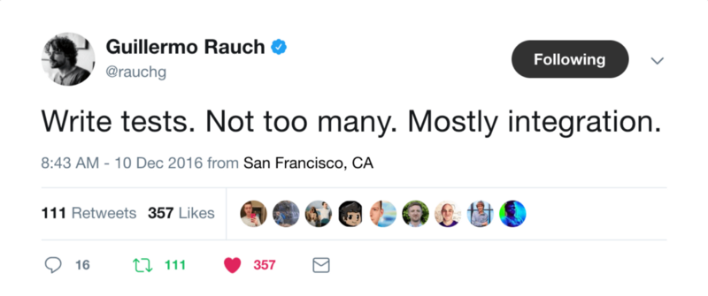

import { Split } from 'mdx-deck/layouts'
export { default as theme } from './MyTheme.js'
import List from './List.js'
import Footnote from './Footnote.js'
import Quote from './Quote.js'

# TDD
---

# Acerca de mí

<List items={[
  'ESPOL #DiSEL',
  'Criptext, Technisys',
  'OSS: yarn, create-react-app, eslint',
  'Clojure, Haskell, JavaScript, Kotlin'
]}/>

---

<List items={[
  '¿Qué es TDD?',
  '¿Es TDD posible?',
  '¿Estas listo para TDD?',
  '¿Es TDD la mejor opción para ti?'
]}/>
---

# Test Driven Development

<List ordered={true} items={[
  'Escribe una prueba que falla',
  'Escribe el código que arregla esa prueba'
]}/>

---

# The Three Laws of  TDD
By now everyone knows that TDD asks us to write unit tests first, before we write production code. But that rule is just the tip of the iceberg. Consider the following three laws:

1. **First Law**. You may not write production code until you have written a failing unit test.
2. **Second Law**. You may not write more of a unit test than is sufficient to fail, and not compiling is failing.
3. **Third Law**. You  may  not  write  more  production  code  than  is  sufficient  to  pass  the  currently failing test

<Footnote 
  author={'Robert C. Martin'} 
  year={'2009'}
  title={'Clean Code A Handbook of Agile Software Craftsmanship'} 
  extra={'132'}/>
---
# F.I.R.S.T

<ul style={{textAlign: 'left'}}>
  <li><strong>F</strong>ast</li>
  <li><strong>I</strong>ndependent</li>
  <li><strong>R</strong>epeatable</li>
  <li><strong>S</strong>elf-Validating</li>
  <li><strong>T</strong>imely</li>
</ul>

<Footnote 
  author={'Robert C. Martin'} 
  year={'2009'}
  title={'Clean Code A Handbook of Agile Software Craftsmanship'} 
  extra={'133'}/>
---
export default Split 

  <h1 style={{textAlign: 'left'}}>Unitarias</h1>
  <ul style={{textAlign: 'left'}}>
    <li>Una sola cosa (??)</li>
    <li>Poca cobertura</li>
    <li>Debug sencillo</li>
  </ul>

  <h1 style={{textAlign: 'left'}}>Integración</h1>
  <ul style={{textAlign: 'left'}}>
    <li>Varios sistemas</li>
    <li>Alta cobertura</li>
    <li>Debug complejo</li>
  </ul>

---

# Test Frameworks

<List items={[
  'Mocha, AVA, Jest',
  'JUnit',
  'HUnit, HSpec',
  'RSpec',
  'unittest'
]}/>

---

# Jest

<List items={[
  'Proyecto de Facebook',
  'Poca configuración',
  'Rápido',
  'Feedback instantáneo',
  'Interactivo'
]}/>

---

# Demos con Jest

---

# ¿Estas listo para TDD?

<ul style={{textAlign: 'left'}}>
  <li>Código modular</li>
  <li>Separation of concerns</li>
  <li>Pure functions</li>
</ul>

---

# ¿Es TDD la mejor opción para ti?

<Quote>Enough. No more. My name is David, and I do not write software test-first. I refuse to apologize for that any more, much less hide it. I'm grateful for what TDD did to open my eyes to automated regression testing, but I've long since moved on from the design dogma.</Quote>

<Footnote 
  author={'David Heinemeier Hansson'} 
  year={'2014'} 
  title={'TDD is dead. Long live testing'} 
  extra={'https://dhh.dk/2014/tdd-is-dead-long-live-testing.html'} />

---

---

<Quote>Integration tests strike a great balance on the trade-offs between confidence and speed/expense. This is why it’s advisable to spend most (not all, mind you) of your effort there.</Quote>

<Footnote 
  author='Kent C. Dodds'
  year='2017'
  title='Write tests. Not too many. Mostly integration'
  extra='https://blog.kentcdodds.com/write-tests-not-too-many-mostly-integration-5e8c7fff591c' />
---

export default Split 

  <h1 style={{textAlign: 'left'}}>👍</h1>
  <ul style={{textAlign: 'left'}}>
    <li>REST APIs</li>
    <li>Librerías</li>
    <li>Wire Protocols</li>
    <li>Bases de datos</li>
  </ul>

  <h1 style={{textAlign: 'left'}}>🙅</h1>
  <ul style={{textAlign: 'left'}}>
    <li>UIs</li>
    <li>Código declarativo</li>
    <li>Código volatil</li>
  </ul>

---

# Fin
